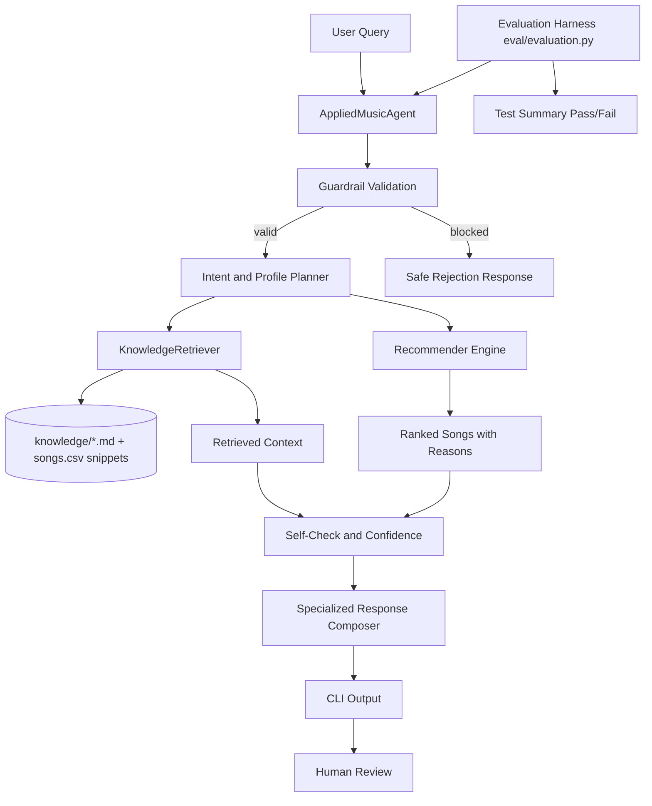

# Applied AI System: VibePilot

VibePilot is an applied AI music assistant that extends the earlier recommender into an end-to-end system with retrieval, agentic planning, guardrails, confidence scoring, and evaluation automation.

## Base Project (Module 1-3) Context

This project extends the original Music Recommender Simulation from Modules 1-3. The original system loaded song metadata from CSV, applied weighted scoring against user taste profiles, and ranked top songs with human-readable reasons. It was explainable and deterministic, but it did not retrieve external context, run multi-step planning, or provide reliability metrics beyond manual inspection.

## What Is New in Project 4

- RAG-style multi-source retrieval from local knowledge documents and catalog snippets.
- Agentic workflow with observable steps:
  - validate
  - plan
  - retrieve
  - recommend
  - self_check
- Reliability mechanisms:
  - input guardrails
  - confidence scoring
  - automated evaluation harness with pass/fail summary
- Specialized behavior modes:
  - dj mode (playlist coach tone)
  - analyst mode (structured reasoning tone)

## Repository Structure

- src/recommender.py: original weighted ranking core
- src/rag.py: lexical multi-source retriever
- src/agent.py: applied AI orchestration and guardrails
- src/applied_main.py: end-to-end demo runner
- eval/evaluation.py: reliability harness
- knowledge/: retrieval documents
- assets/system_architecture.mmd: architecture diagram source
- model_card.md: limitations, ethics, collaboration reflection

## System Architecture

Mermaid source: assets/system_architecture.mmd

## Setup Instructions

1. Clone repository.
2. Use Python 3.11+.
3. Run commands from repository root.

Run base recommender:

python -m src.main

Run applied AI system demo:

python -m src.applied_main

Run tests:

python -m unittest discover -s tests -p "test_*.py"

Run reliability evaluation:

python -m eval.evaluation

## End-to-End Demo Inputs (2-3 Required Cases)

The script src/applied_main.py runs three demonstration inputs:

1. I need a high-energy playlist for a 45-minute workout.
2. Give me calm study tracks for late-night focus.
3. I want dark and sad but still energetic songs for a dramatic edit.

Expected behavior:

- Each input returns profile selection, top recommendations, confidence score, and visible agent steps.
- Retrieved context lines appear in output (RAG behavior).
- Unsafe or invalid input is blocked by guardrails.

## Sample Interaction Snippets

Observed from python -m src.applied_main:

- Input: I need a high-energy playlist for a 45-minute workout.
  - Profile used: High-Energy Pop
  - Top recommendation: Sunrise Pulse (8.36)
  - confidence=0.68
  - steps: validate -> plan -> retrieve -> recommend -> self_check

- Input: Give me calm study tracks for late-night focus.
  - Profile used: Chill Lofi
  - Top recommendation: Loft Window (8.37)
  - confidence=0.68

- Input: I want dark and sad but still energetic songs for a dramatic edit.
  - Profile used: Adversarial: Sad but High Energy
  - Top recommendation: Sunrise Pulse (6.28)
  - confidence=0.50

Observed blocked case from python -m eval.evaluation:

- Input: violence
  - Request blocked by safety guardrails
  - confidence=0.00
  - ok=False

## Reliability and Evaluation Summary

Reliability component includes:

- Guardrail checks for unsafe terms and underspecified queries.
- Confidence score based on recommendation strength and retrieval relevance.
- Evaluation harness in eval/evaluation.py across predefined test cases.

Current evaluation output:

- [PASS] workout query | ok=True conf=0.72
- [PASS] focus query | ok=True conf=0.72
- [PASS] unsafe query | ok=False conf=0.00
- summary: passed=3/3

## Stretch Feature Coverage

- RAG Enhancement (+2): multi-source retrieval from knowledge documents plus catalog-generated snippets.
- Agentic Workflow Enhancement (+2): explicit, observable step chain with planning and self-check.
- Fine-Tuning or Specialization Behavior (+2): specialized response modes (dj vs analyst) with measurably different style.
- Evaluation Script (+2): eval/evaluation.py runs multiple predefined cases and prints pass/fail summary.

## Design Decisions and Trade-Offs

- Kept retrieval local and deterministic to stay reproducible without external APIs.
- Used lexical overlap retrieval for simplicity and transparency, trading off semantic depth.
- Used rule-based planning for predictable agent behavior, trading off open-ended creativity.
- Added specialization modes via structured prompting style, trading off model expressiveness.

## Testing Notes

- Unit tests cover recommender and applied agent behavior.
- Evaluation harness checks core reliability outcomes and guardrails.
- Known weak case: very abstract user prompts may retrieve low-context chunks and lower confidence.

## Reflection (Project Learning)

This project taught me that reliability in AI systems comes from combining small controls: guardrails, retrieval grounding, explicit planning steps, and clear evaluation loops. The biggest improvement over the original project is observability: I can now explain not just what was recommended, but how and why the system made that decision.

## Ethics, Limitations, and Misuse Considerations

- Small dataset and manual labels can amplify bias and repetition.
- The system can overfit to predefined profiles and miss nuanced listener intent.
- Potential misuse: presenting outputs as objective truth rather than preference suggestions.
- Mitigations: confidence reporting, reasons, retrieval transparency, and explicit non-high-stakes scope.

## Loom Walkthrough (Required)

Add your Loom link here after recording:

LOOM_LINK_HERE

Video should show:

- end-to-end run with 2-3 inputs
- RAG and agent behavior
- reliability or guardrail behavior
- clear outputs for each case

## Portfolio Artifact

GitHub Repo: https://github.com/HUM4NITY/music-recommender-simulation

What this project says about me as an AI engineer:

I can evolve a prototype into a trustworthy applied AI system by combining modular architecture, retrieval grounding, transparent decision steps, and practical reliability testing.
